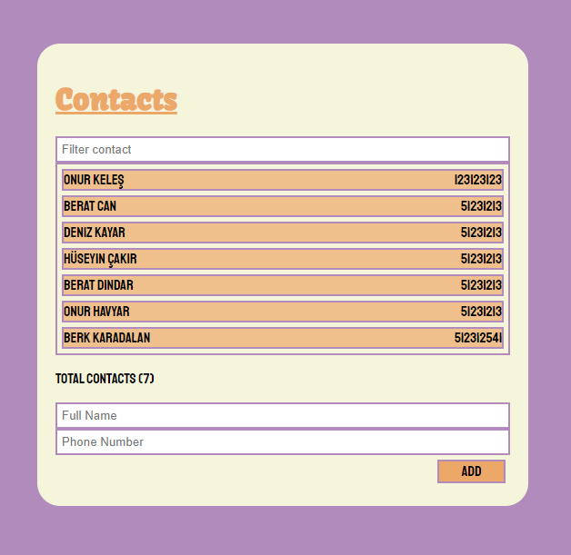
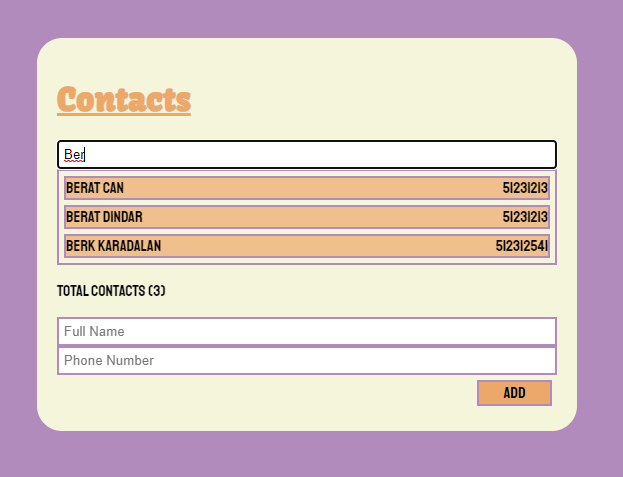
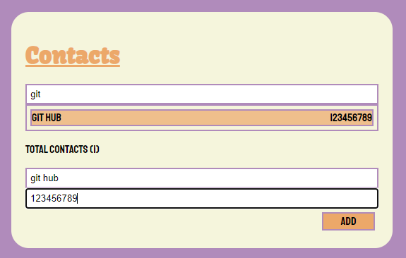

## Rehber Uygulaması
React öğrenme sürecimde oluşturmuş olduğum basit bir rehber uygulaması.


## Kurulum ve Çalıştırma
``` bash
# gerekli kurulumların yapılması
npm install

# uygulamayı çalıştırmak için
npm start
```
## Ekran Görüntüleri
<br>
Uygulamanın kendisi


<br>
Burada filtreleme özelliği kullanılıyor

<br>
Burada kişi ekleme özelliği kullanılıyor
